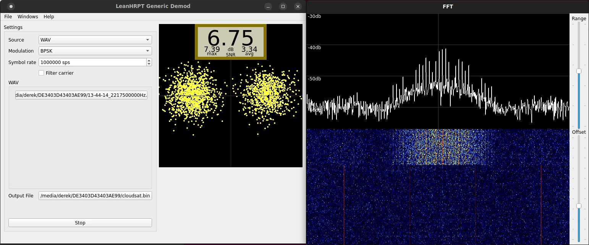

# LeanHRPT Demod

[](https://github.com/Xerbo/LeanHRPT-Demod/actions/workflows/build.yml)

A demodulator for weather satellites. Also see [LeanHRPT Decode](https://github.com/Xerbo/LeanHRPT-Decode).



## Installation

Compiled builds for Linux and Windows are available from the [releases](https://github.com/Xerbo/LeanHRPT-Demod/releases) page.

And then see the [wiki](https://github.com/Xerbo/LeanHRPT-Demod/wiki) for how to use.

## Building from source

For those who wish to compile from source you will need `qtbase5-dev`, [`libcorrect`](https://github.com/quiet/libcorrect), `libsndfile1-dev`, `libsndfile1-dev` and a C++11 compiler (tested with gcc, clang and MSVC) installed. After that you can compile with:

```sh
mkdir build && cd build
cmake -DCMAKE_BUILD_TYPE=Relase ..
make
```
You can also enable some experimental features by adding `-DEXPERIMENTAL=ON` to cmake.
